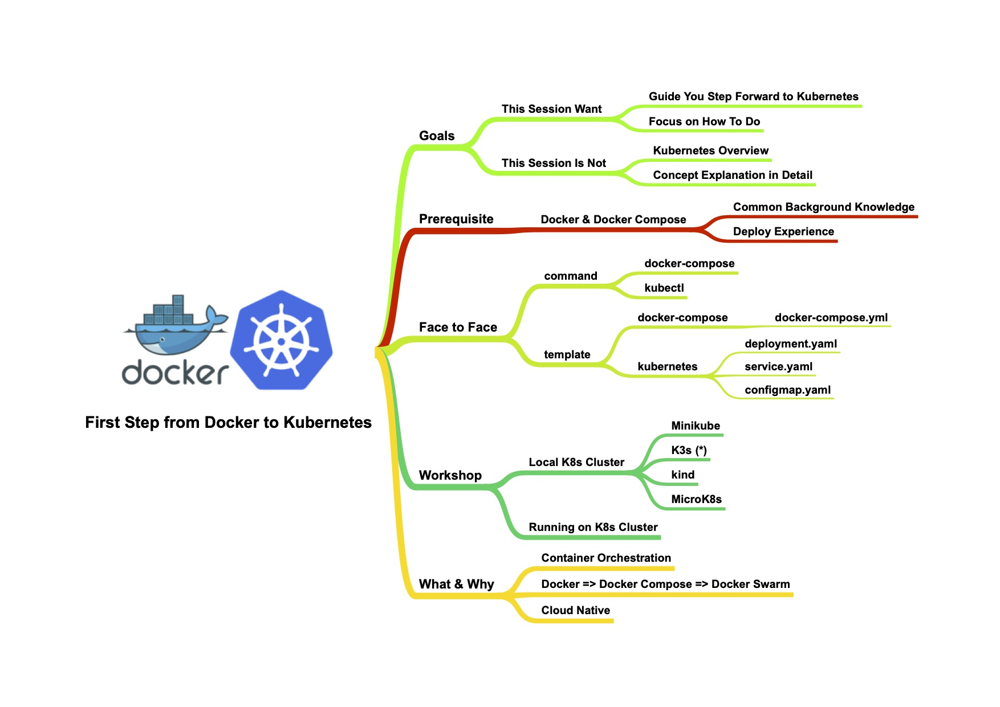

# First Step from Docker to Kubernetes

### Directory
* [python-sample](./python-sample/README.md) -> sample project of python service
* [java-sample](./java-sample/README.md) -> sample project of java service 
* [k8s](./k8s/README.md) -> sample deployment project kubernetes

### Agenda

### References
* https://docs.docker.com/compose/compose-file/
* https://kubernetes.io/docs
